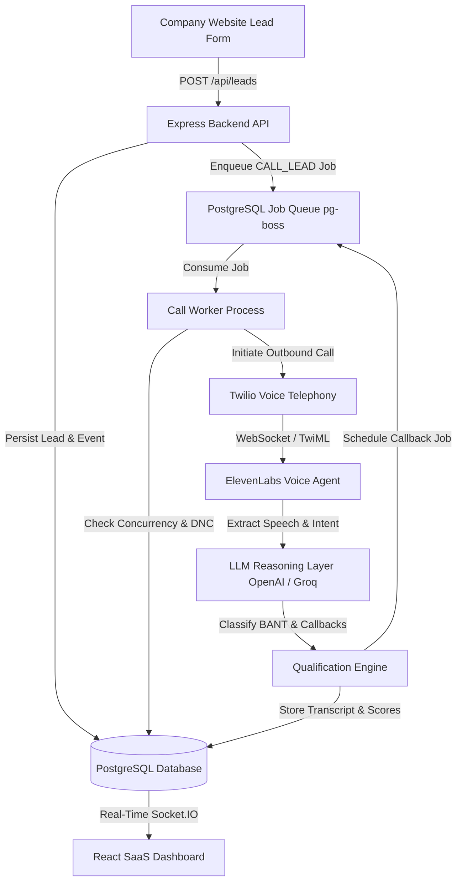

# AI Lead Qualification & Autonomous Voice Calling Platform

An outbound voice lead qualification platform built for software development companies. The platform detects new leads submitted via website forms, automatically schedules or immediately initiates outbound voice calls via Twilio, converses using ElevenLabs Voice Agents and configurable LLM reasoning (OpenAI, Groq, Anthropic), qualifies leads according to BANT criteria, schedules dynamic callbacks, and streams real-time telemetry to a dark-themed SaaS dashboard.

> **IMPORTANT ARCHITECTURAL REQUIREMENT**: Zero Redis dependency. All job queues, retries, and scheduled callbacks strictly run on PostgreSQL via `pg-boss` / transactional PostgreSQL worker queues.

---

## 1. System Architecture



---

## 2. Key Capabilities & Business Rules

1. **Lead Ingestion & Duplicate Protection**:
   - `POST /api/leads` validates incoming phone numbers to E.164 format (`+919876543210`).
   - Prevents duplicate active calls for the same phone number or pending queue job.
   - Immediate HTTP response without blocking on phone call execution.
2. **Zero-Redis PostgreSQL Queue**:
   - `pg-boss` manages immediate calling jobs, delayed calls, retries, and callback schedules backed entirely by PostgreSQL.
3. **Strict Call Isolation**:
   - No global conversation state. Every message turn, transcript, and qualification metric is bound to unique `callAttemptId` and `twilioCallSid`.
4. **Timezone-Aware Dynamic Callback Engine**:
   - Natural language time resolution (e.g. *"Call me tomorrow at 3 PM"*, *"in 15 minutes"*, *"after 5 PM"*) parsed into UTC timestamps using configured timezone (`Asia/Kolkata` default).
   - Rule 8 Enforced: Scheduling decisions are validated and executed by backend business logic, not direct LLM DB mutations.
   - Context Preservation: Callback attempts preserve previous call summaries to maintain continuity.
5. **Do-Not-Call (DNC) Enforcement (Rule 1)**:
   - Immediate marking of `DO_NOT_CALL` status when requested. All workers check DNC status before initiating any call attempt.
6. **BANT Qualification Engine**:
   - Configurable question progression and scoring rules for **Need (25)**, **Budget (25)**, **Authority (20)**, **Timeline (20)**, and **Fit (10)**.

---

## 3. Technology Stack

- **Frontend**: React 19, Vite, Tailwind CSS v4, React Router v7, Recharts, Lucide Icons, Socket.IO Client.
- **Backend**: Node.js, Express.js, Prisma ORM, `pg-boss` (PostgreSQL job queue), Socket.IO, Twilio SDK, ElevenLabs API, Vitest.
- **Database**: PostgreSQL 15.
- **LLM Abstraction**: Configurable provider adapters (`OpenAIAdapter`, `GroqAdapter`).

---

## 4. API Endpoints Reference

### Lead Management
- `POST /api/leads` - Ingest lead & enqueue call (Supports optional `delaySeconds`).
- `GET /api/leads` - List leads with pagination, search, and status filters.
- `GET /api/leads/:id` - Lead detail file, call history, BANT scores, and transcript.
- `PATCH /api/leads/:id` - Update lead status.

### Telephony & Calls
- `GET /api/calls` - View historical call attempt logs.
- `GET /api/calls/active` - Live telemetry of currently active calls.
- `GET /api/calls/:id` - Detailed call attempt metadata and formatted transcript.
- `POST /api/calls/trigger` - Manually trigger an outbound call job.

### Callbacks & Analytics
- `GET /api/callbacks` - List scheduled callbacks in PostgreSQL.
- `PATCH /api/callbacks/:id/cancel` - Cancel a pending callback.
- `GET /api/analytics/overview` - Dashboard stat cards metrics.
- `GET /api/analytics/charts` - Recharts status and score distribution data.

### System & Webhooks
- `POST /api/webhooks/twilio/voice` - Twilio TwiML connect hook.
- `POST /api/webhooks/twilio/status` - Idempotent call status update callback.
- `POST /api/webhooks/twilio/speech` - Speech-to-text transcript reasoning turn.
- `GET /api/health` - Comprehensive system health inspect (DB, Queue, Twilio, ElevenLabs, LLM).

---

## 5. Local Setup & Execution Guide

### Prerequisites
- Node.js v20+ & npm
- PostgreSQL database running locally or in Docker

### Step 1: Clone & Configure Environment
Create `.env` file in the root directory (or copy `.env.example`):
```bash
cp .env.example .env
```

### Step 2: Install Dependencies
```bash
# Install backend dependencies
cd backend && npm install

# Install frontend dependencies
cd ../frontend && npm install
```

### Step 3: Run Database Migrations & Seed
```bash
cd backend
npx prisma db push
node prisma/seed.js
```

### Step 4: Start Backend API & Queue Workers
```bash
# Start backend server & embedded pg-boss worker pool
npm run dev

# Or run standalone worker process in a separate terminal
npm run worker
```

### Step 5: Start React SaaS Dashboard
```bash
cd ../frontend
npm run dev
```
Open `http://localhost:3000` in your browser. Default Admin Login: `admin@vedron.dev` / `admin123`.

---

## 6. Docker Deployment

Launch PostgreSQL, Express API Server, Worker runner, and React Dashboard using Docker Compose:

```bash
docker-compose up --build -d
```

Services exposed:
- **React SaaS Dashboard**: `http://localhost:3000`
- **Express Backend API**: `http://localhost:5000`
- **PostgreSQL Database**: `localhost:5432`

---

## 7. Running Automated Tests

```bash
cd backend
npm test
```

---

## 8. Development Verification Checklist (MVP Criteria)

- [x] Ingest lead via `POST /api/leads` and store in PostgreSQL.
- [x] Enqueue call job in `pg-boss` (Zero Redis).
- [x] Outbound call attempt with Twilio + ElevenLabs integration.
- [x] Natural conversational reasoning with pluggable LLM provider (OpenAI / Groq).
- [x] Dynamic callback parsing in configured timezone (`Asia/Kolkata`).
- [x] Enforce DNC rules and duplicate call protection.
- [x] Store complete transcripts, BANT scores, and summaries.
- [x] Real-time updates on modern SaaS dark dashboard via WebSockets.


# command
# Tunnel                                                                                       
>> npx localtunnel --port 5000  


1. Start the Backend

Open Terminal 1 and navigate to the backend:

cd "D:\My Files desktop\SankalpVoiceAgent\backend"

Start the backend using the project's normal start command.

The backend must run on:

http://localhost:5000

To verify that port 5000 is being used:

netstat -ano | findstr :5000

You should see something similar to:

TCP    0.0.0.0:5000    0.0.0.0:0    LISTENING    <PID>

Keep the backend terminal running.

2. Start Cloudflare Tunnel

Open Terminal 2.

Run:

cloudflared tunnel --url http://localhost:5000

Cloudflare will generate a temporary public URL.

Example:

https://blues-cents-distant-lawn.trycloudflare.com

The URL will look like:

https://<random-name>.trycloudflare.com

Keep this terminal running while using the voice agent.

The tunnel forwards:

https://<random-name>.trycloudflare.com
                    ↓
            http://localhost:5000
3. Update the Public URL

The Cloudflare URL must be used wherever the application expects the public callback/webhook URL.

For example, if .env contains:

PUBLIC_URL=https://old-url.loca.lt

change it to:

PUBLIC_URL=https://<random-name>.trycloudflare.com

Only change environment variables that specifically contain the public/tunnel URL.

Do NOT change:

PORT=5000

or other unrelated environment variables.

If the backend reads the public URL from .env, restart the backend after changing the .env file.

4. Update ElevenLabs

The schedule_callback tool in ElevenLabs must also use the current Cloudflare URL.

For example, if the old URL is:

https://green-jobs-shout.loca.lt/schedule-callback

replace only the hostname:

https://<random-name>.trycloudflare.com/schedule-callback

For example:

OLD:
https://green-jobs-shout.loca.lt/schedule-callback

NEW:
https://blues-cents-distant-lawn.trycloudflare.com/schedule-callback

Keep the endpoint path exactly the same.

Do not change the request body or callback parameters when changing the hostname.

5. Verify the Tunnel

You can test that the Cloudflare tunnel is forwarding requests to the backend.

For example:

curl.exe -i https://<random-name>.trycloudflare.com/<endpoint>

If the backend does not have a /health endpoint, this:

404 Cannot GET /health

does NOT necessarily mean that Cloudflare is broken.

It can mean:

Cloudflare
    ↓
localhost:5000
    ↓
Backend received request
    ↓
Backend does not have /health route
    ↓
404

The important thing is that the request reached the backend.

🔄 Starting the Project Every Time

Use exactly two terminals.

Terminal 1 — Backend
cd "D:\My Files desktop\SankalpVoiceAgent\backend"

Start the backend using the normal project command.

Make sure it runs on:

http://localhost:5000
Terminal 2 — Cloudflare
cloudflared tunnel --url http://localhost:5000

Copy the generated:

https://<random-name>.trycloudflare.com

Then update:

.env public URL, if required
ElevenLabs schedule_callback tool URL

If the .env was changed, restart the backend.

Then test the voice agent.

🛑 Stopping Cloudflare

To stop the Cloudflare tunnel:

Go to the terminal where cloudflared is running and press:

Ctrl + C

This stops the Cloudflare tunnel only.

It does NOT stop the backend.

🛑 Stopping the Backend

Go to the backend terminal and press:

Ctrl + C

This stops the backend.

The backend and Cloudflare tunnel are separate processes.

Terminal 1
Backend
localhost:5000

Terminal 2
Cloudflare Tunnel
trycloudflare.com → localhost:5000
⚠️ Important: Cloudflare Quick Tunnel URLs Are Temporary

Cloudflare Quick Tunnels generate temporary URLs.

For example:

Today:
https://blues-cents-distant-lawn.trycloudflare.com

After restarting the tunnel, you may get:

https://another-random-name.trycloudflare.com

If the URL changes, you MUST update:

.env

and:

ElevenLabs
→ schedule_callback
→ Tool URL

Otherwise ElevenLabs will continue trying to call the old tunnel URL.

🧠 Development Setup

During local development, the recommended setup is:

┌──────────────────────────────────────┐
│ Terminal 1                           │
│                                      │
│ Backend                              │
│ localhost:5000                       │
└──────────────────────────────────────┘

┌──────────────────────────────────────┐
│ Terminal 2                           │
│                                      │
│ Cloudflare Tunnel                    │
│                                      │
│ cloudflared tunnel                   │
│ --url http://localhost:5000          │
└──────────────────────────────────────┘

The complete request flow is:

Customer
    ↓
ElevenLabs Voice Agent
    ↓
Cloudflare HTTPS URL
    ↓
localhost:5000
    ↓
Backend
    ↓
schedule_callback
    ↓
Database
    ↓
Worker
    ↓
Callback Call
🚀 Production

Cloudflare Quick Tunnel is intended for local development and testing.

It should NOT be treated as the permanent production setup because the trycloudflare.com URL is temporary.

For production, deploy the backend to a proper server/cloud platform with a permanent HTTPS URL.

Then ElevenLabs can call the permanent backend URL directly:

ElevenLabs
    ↓
Permanent HTTPS Backend URL
    ↓
Production Backend

No LocalTunnel or Cloudflare Quick Tunnel will be required in production.

📌 Cloudflare Commands
Check installation
cloudflared --version
Start tunnel
cloudflared tunnel --url http://localhost:5000
Stop tunnel
Ctrl + C
Check backend port
netstat -ano | findstr :5000
Check which process owns port 5000
tasklist | findstr <PID>
⚠️ Important Rules
Only run one backend process on port 5000.
Only run one Cloudflare tunnel for this local backend.
Do not run LocalTunnel and Cloudflare Tunnel simultaneously.
Keep the Cloudflare terminal open while testing.
Keep the backend terminal open while testing.
If the Cloudflare URL changes, update ElevenLabs.
If .env contains the public URL, update it when the tunnel URL changes.
Never change PORT=5000 just because the public URL changes.
Do not hardcode the temporary Cloudflare URL in application source code.
leadId is owned by the backend and should be passed to ElevenLabs as a dynamic variable.
The LLM should extract timeText, timezone, and reason; it should not generate or infer leadId.